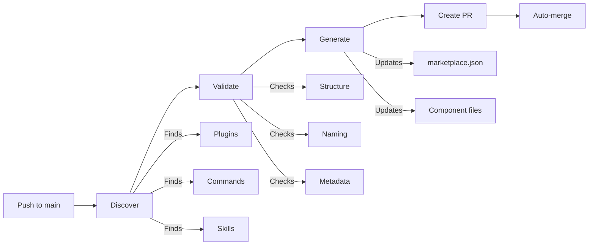

# Bitcomplete GitHub Actions

Reusable GitHub Actions workflows for Claude Code development and Platform Engineering. We use these workflows ourselves, and now you can too.

## Actions

### Agentic Marketplace Automation

Automates Claude Code plugin marketplace management through auto-discovery, validation, and synchronization.

**Features:**
- Auto-discovery of plugins and components
- Structure and naming validation
- Automatic marketplace.json generation
- PR-based workflow with optional auto-merge

[View agentic-marketplace action documentation →](agentic-marketplace/README.md)

## Basic Agentic Marketplace Publish Workflow

When you push changes to an agentic marketplace repository, the workflow automatically discovers, validates, and updates your marketplace.json:



**How it works:**

1. **Discover** - Scans your repository for plugins, commands, skills, and other components based on your configuration
2. **Validate** - Checks that all components follow naming conventions, have required metadata, and match your validation rules
3. **Generate** - Creates or updates marketplace.json with all discovered components
4. **Create PR** - Opens a pull request with the changes for review
5. **Auto-merge** - Optionally merges the PR automatically if validation passes

This happens automatically on every push to your main branch. No manual JSON editing required.

## Quick Start

### Using Agentic Marketplace Automation

Add this to `.github/workflows/agentic-marketplace.yml` in your marketplace repository:

```yaml
name: Update Agentic Marketplace

on:
  push:
    branches: [main]
  pull_request:
    branches: [main]

jobs:
  update:
    uses: bitcomplete/bc-github-actions/.github/workflows/agentic-marketplace.yml@v1
    with:
      config-path: .claude-plugin/generator.config.toml
    secrets:
      token: ${{ secrets.GITHUB_TOKEN }}
```

Or use individual actions in your own workflow:

```yaml
- uses: bitcomplete/bc-github-actions/agentic-marketplace/discover@v1
  with:
    config-path: .claude-plugin/generator.config.toml

- uses: bitcomplete/bc-github-actions/agentic-marketplace/validate@v1
  with:
    config-path: .claude-plugin/generator.config.toml

- uses: bitcomplete/bc-github-actions/agentic-marketplace/generate@v1
  with:
    config-path: .claude-plugin/generator.config.toml
    github-token: ${{ secrets.GITHUB_TOKEN }}
    auto-merge: true
```

## Versioning

We use semantic versioning with floating major tags:

- `@v1` - Floating major version (recommended for production)
- `@v1.0.0` - Pinned version for maximum stability
- `@main` - Latest development version

## License

MIT License - see [LICENSE](LICENSE) for details.
